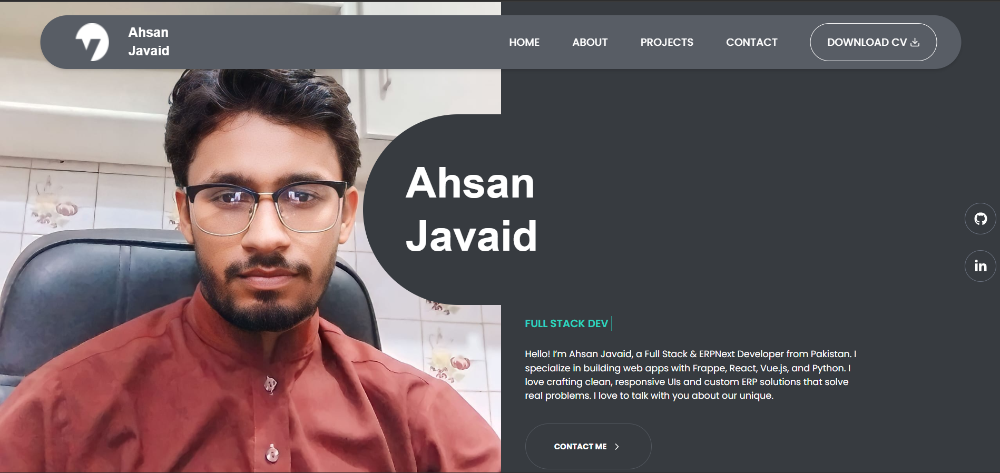

Name of Project
Ahsan Javaid – Personal Developer Portfolio

📚 Table of Contents
Overview

Built With

Features

Projects

Experience

Contact

Acknowledgements

🔍 Overview
A sleek, animated portfolio showcasing my work in Frappe, web development, and design. It highlights my skills, projects, and professional experience in a modern and responsive layout.
Portfolio Picture

🛠️ Built With
React

Tailwind CSS

Framer Motion / GSAP (for animations)

Vite

GitHub Pages 

Vercel for Deployment

✨ Features
Sidebar navigation

Animated sections using Framer Motion

Project showcase with filters

Responsive and mobile-friendly design

Contact form with backend integration

Scroll and hover effects for better UX

💼 Projects
Library Management System (Frappe + Vue)

WhatsApp Integration in ERPNext (without Twilio)

Personal Portfolio Website (React + Tailwind)

Animated Cards & UI Effects (GSAP)

🧑‍💻 Experience
Junior Web Developer at Lighthouse Technologies

Frappe Developer (School and Library ERP System)

Graphic Designer at Protech Automotive Glass Industries

📬 Contact
Email: ehsanjavaid321@gmail.com
GitHub: (https://github.com/ehsanjavaid)
LinkedIn:(https://www.linkedin.com/in/ahsan-javaid-75032319b/)